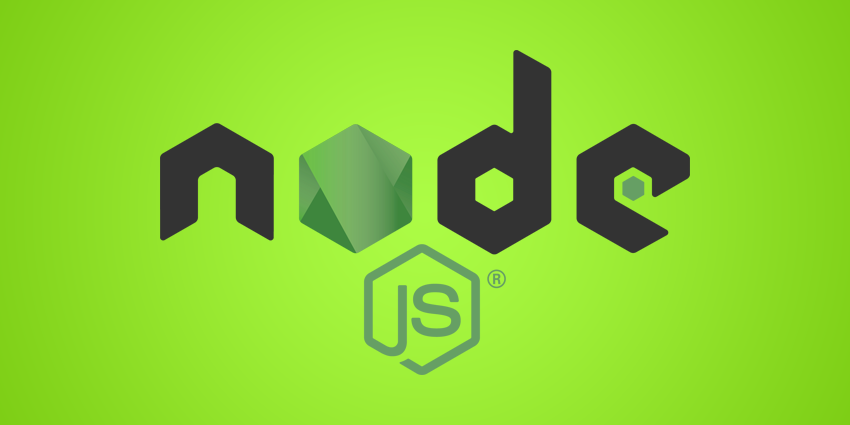

  

## 
Step by Step Process to run the test.

Quick Start

* Download the latest version of node.js [here!](https://www.nodejs.org)
* Type "node --version" in your terminal, if it display the node version it means it is installed successfully.
* Make a directory
* Add src folder and create index.js file
* Add test folder and create index.js file
* Inside your index.js in src folder put the function for testing and export that function by typing module.exports = (function_name);
* In the test folder index.js you can call that function by typing var/const/let (function_name) = require('../src/index');
* Insert the assert type let assert = require('assert');
* Then you can put your testing here, See sample here at [Mocha](https://www.davidbaumgold.com/tutorials/automated-tests-node/) category.

**Configure Terminal and Testing**

1. Install mocha you can type "npm install mocha -g --save-dev" for global or "npm install mocha --save-dev"
2. Install nodemon by typing "npm install nodemon --save-dev
3. Then initialize "npm init"
4. package.json will pop up after npm init, click it and look for the scripts: then test: type "nodemon --exec mocha -R min" and save
5. add .gitignore file and put file extension you wish not to include.
6. Run the test by typing npm test

> Good Luck - Saint Jhan :)
